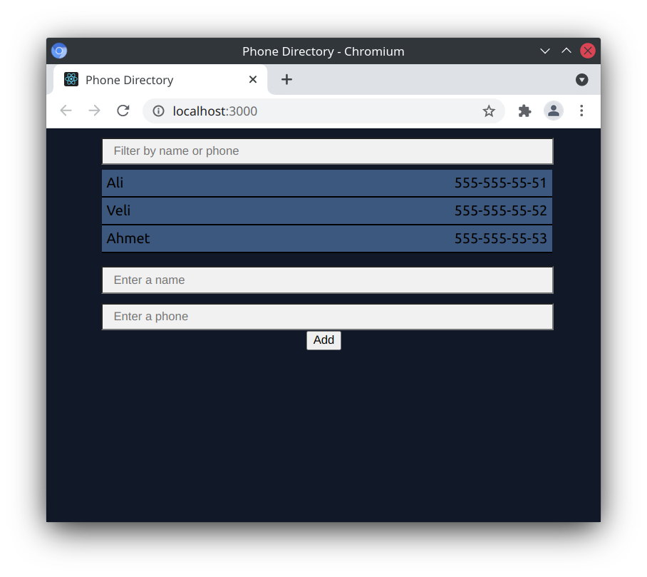
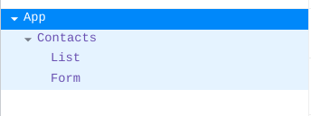

## What Did I Do

- Component Tree

	

- Form Component:
	- `state = {name: "",phone: "",};`
	- onChange Function:
		Maps the entered expressions to the same element in state.

	- onSubmit Function:
		It puts the data in the form to *addContact* in the props, then cleans the data in the state

- List Component:

	Filters and lists data from props by data from input
	
- Contact Component:

	It distributes props from App.js to related components.

- App component:

	Our data is here.

	We wrote the AddContact function used by the form component here, because they are at the same level as the component we want to list the data with, and because react adopts the ***one way data binding*** philosophy

- I create a ***stateless component***\
	Contacts componenti
	```js
	const Contacts = (props) => (
	<div>
		<List contacts={props.contacts} />
		<Form addContact={props.addContact} />
	</div>
	);

	export default Contacts;
	```
	

- I use PropTypes library for data integrity and reliability
	```js
	Contacts.propTypes = {
		contacts: PropTypes.array.isRequired,
		addContact: PropTypes.func,
	};
	```

- I use two different function bind method:
	- Bind in constructor (in Form.js):
		```javascript
		constructor() {
			super();
			this.onChange = this.onChange.bind(this);
		}

		onChange(e) {
			this.setState({ 
				[e.target.name]: e.target.value 
			});
		}
		``` 
	- Using as arrow function (in List.js):
		```js
		onChangeFilterText = (e) => {
			this.setState({ filterText: e.target.value });
		};
		```

## Installation

In the project directory, you can run:

### `npm install` 

Downloads to all dependency packages

### `npm start`

Runs the app in the development mode.\
Open [http://localhost:3000](http://localhost:3000) to view it in the browser.

The page will reload if you make edits.